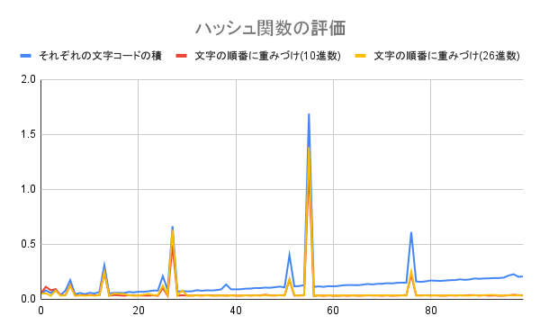

# 課題1 ハッシュ表を作成する

## 1. Context

ハッシュテーブルの仕組みを理解するために、Pythonの組み込み辞書型やcollectionsライブラリを使用せずに、自分で実装する。

- put(key, value) :  入力された単語の追加
- get(key) : 入力された単語の検索
- delete(key) : 入力された単語の削除

## 2. Goal

- O(1)で探索、削除、追加ができること
  - 要素数に応じてハッシュ表が変化すること
  - 適切なハッシュ関数を考えること

<!-- ## 3. Non-Goals -->

<!-- 明確に対応しない範囲

 期待されそうだけど対象外なもの（誤解防止） -->

## 3. 概要（Overview / High-level Design）

### 構成

< Item Class >
key : ハッシュ値（配列のインデックス）
value : 値
next : 次のノードへのポインタ

<!-- 
- システム全体の構造や流れを図や文章で説明
- コンポーネントの役割やデータの流れ
- アーキテクチャ図があると◎ -->

## 4. 詳細設計（Detailed Design）

<!-- - 各コンポーネント/モジュールの詳細
- API仕様、データ構造、クラス設計など
- 例：
  - 新しいクラスとその責務
  - API endpoint の定義（メソッド、パス、リクエスト/レスポンス形式） -->

### 再ハッシュ関数（new_bucket_sizeが引数)

```

self.buckets = [ ..., (key1 → key2), ..., None, (key3), ... ]
self.bucket_size = 今のサイズ

```

1. 古いハッシュ表全体をold_bucketsに保存
2. 新しいハッシュ表を作成(self.buckets = [None] * new_bucket_size)
3. 古いハッシュ表に入っている単語を探索
   1. 古い単語のheaderを取得
   2. headerがNoneでなくなるまで、新しいハッシュ値を計算して、ハッシュテーブルにいれる

```
while header:   # それぞれのハッシュ表の先頭

  bucket_index = calculate_hash(header.key) % new_bucket_size # 新しいハッシュ値を計算
  new_item = Item(header.key, header.value, self.buckets[bucket_index]) # 新しいアイテムを作って、最初に追加する
  self.buckets[bucket_index] = new_item   # 最初に挿入(LIFO)

  header = header.next
```

## 6. 代替案の検討（Alternatives Considered）

<!-- - 他のアプローチとその比較
- なぜ今回の設計を選んだのか
- 落とし穴やトレードオフの説明 -->

### ハッシュ関数の選択

なるべく$O(1)$に近づくことができるようなハッシュ関数について考える。試したハッシュ関数は以下の3種類である。

  🔵  文字全てのordをかける
  🔴  $i$文字目に $10^i$ をかける
  🟡  $i$文字目に $26^i$ をかける

これらの3種類のハッシュ関数を試行してみた結果、以下のグラフのようになった。



上記グラフより、🔴が最も早いことがわかった。また、🟡も同程度の速さとなっている。これは、`performance_test()`数字の文字は10種類しかないため、基数が10の🔴 の方式が最適化されやすい。一方、🟡 は26種類の文字を想定しているため、数字のみの文字列の場合は若干効率が落ちる可能性がある。

## 8. Open Questions

要素数が
    テーブルサイズの70%以上→テーブルサイズを2倍に
    テーブルサイズの30%以下→テーブルサイズを半分に
    テーブルサイズは奇数になるように調整すると衝突が減る！
ってしたけど、要素サイズだったら、全部が同じハッシュ値のときに無駄な気がしてしまう

|    | delete追加後 | 再ハッシュ追加 |
| -- | ------------ | -------------- |
| 0  | 0.173461     | 0.152137       |
| 1  | 0.446066     | 0.375360       |
| 2  | 0.737767     | 0.428901       |
| 3  | 1.903551     | 0.994531       |
| 4  | 2.309710     | 0.998585       |
| 5  | 2.933915     | 1.391268       |
| 6  | 3.910172     | 3.195585       |
| 7  | 4.708501     | 2.062178       |
| 8  | 5.670644     | 2.671113       |
| 9  | 6.620760     | 3.447553       |
| 10 | 7.426284     | 4.174071       |
| 11 | 8.669435     | 4.940521       |
| 12 | 10.292811    | 5.541485       |
| 13 | 10.746608    | 8.913878       |
| 14 | 11.923239    | 5.154517       |
| 15 | 12.834364    | 5.976301       |
| 16 | 13.764087    | 6.382113       |
| 17 | 14.952469    | 7.035882       |
| 18 | 15.216579    | 7.689575       |
| 19 | 16.709612    | 8.767005       |
| 20 | 17.373407    | 9.438327       |
| 21 | 18.556663    | 9.926766       |
| 22 | 19.945317    | 11.043416      |
| 23 | 20.498146    | 11.563988      |
| 24 | 22.214007    | 12.276625      |
| 25 | 22.681324    | 12.815739      |
| 26 | 23.899294    | 13.624502      |
| 27 | 25.061849    | 19.097142      |
| 28 | 25.450991    | 11.074549      |
| 29 | 26.298644    | 11.813620      |
| 30 | 27.593229    | 12.590825      |

<!-- 
## 6. 代替案の検討（Alternatives Considered）

- 他のアプローチとその比較
- なぜ今回の設計を選んだのか
- 落とし穴やトレードオフの説明

## 7. テスト計画（Testing Plan）

- 単体テスト・統合テスト・E2E テストなど
- テストの対象と手法
- 失敗ケースや境界条件もカバーしているか

## 8. Open Questions）

- 現時点での不確実な部分やリスク
- 要議論事項（明確でなくてもOK）

## 10. 関連資料・リンク（Appendix / References）

- 関連 issue, PR, 設計資料、ミーティングノートなど -->
