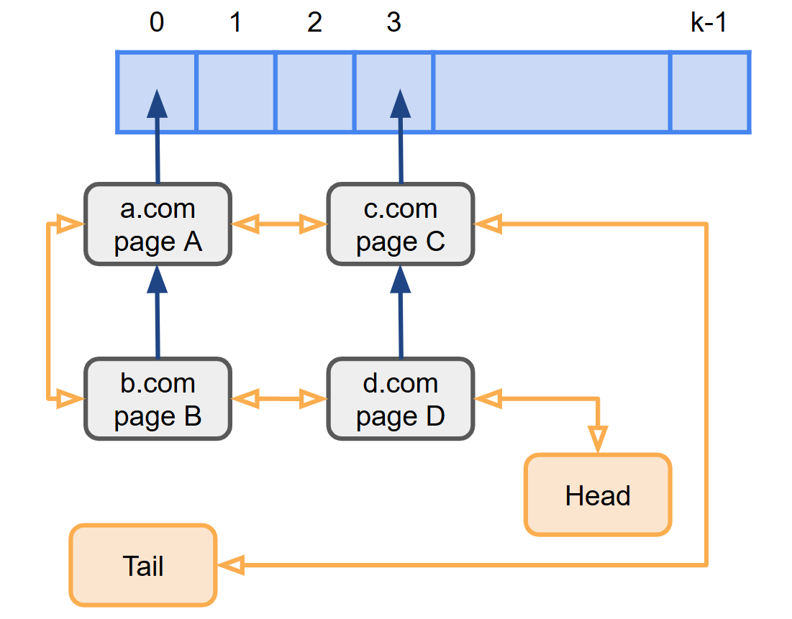
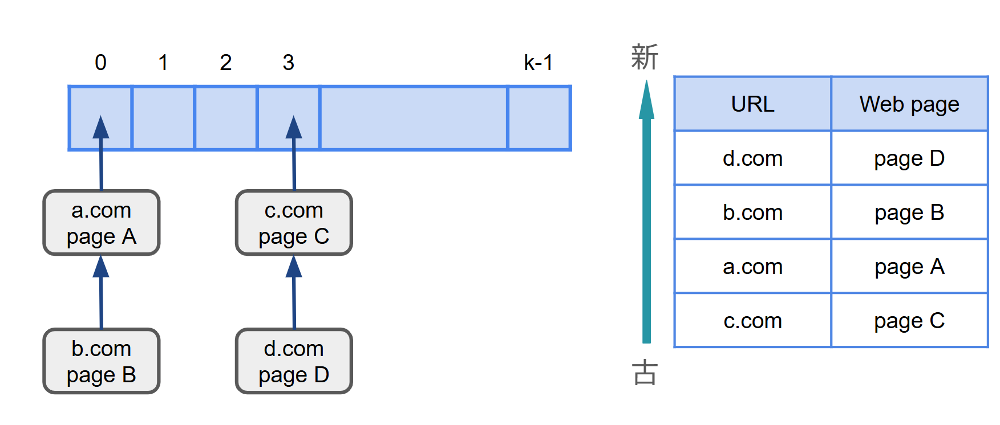

## 目標

キャッシュの管理をほぼ$O(1)$で実現できるデータ構造を考える。

## 制約

- 与えられた `<URL , Webページ>`で実現できるデータ構造を考えるがあるかないかを検索
- もしない場合、キャッシュ内の一番古い `<URL , Webページ>`を捨てて、代わりに与えられた `<URL , Webページ>`を追加する

[ヒント💡]

- ハッシュテーブルだけだと順序を管理できないので、別のデータ構造を組み合わせて、X個の<URL , Webページ>をアクセスされた順に取り出せるようにする

## 案の検討

### 双方向ポインタを用いる方法(最適✨)

###### [ 構造 ]

キャッシュを保存するためのハッシュ構造を作成。また、D個のキャッシュ履歴を残すために、アクセスした順番を保存するための双方向リスト(最初は `Header`、最後は `Tail`、それぞれのノードは `next`と `prev`)を作成する。

###### [ 方法 ]

1. 最新のアクセス履歴のハッシュ値を計算し、ハッシュテーブルに存在するか確認
2. もし存在すれば、`Head`の次のノードになるようにポインタを付け替える
3. 存在しないならば、新たにノードを作成し、`Head`の次に挿入する。
4. ノードの数がD個を超えた場合は `Tail`の直前のノードを削除する。

### キューのような配列を使う方法

###### [ 方法 ]

1. ハッシュ値をURLとwebpage名から計算する
2. ハッシュテーブルに `<URL,web page>`を追加O(1)
   - 得られたハッシュ値が一緒だったらポインタでつなぐ
3. そのハッシュ値、URLとwebpageをアクセス順に配列に格納
   - 被っていたら、その要素を一番最後に
   - 被っていなければ、一番最初の要素を削除後その要素を一番最後に(キューのような形)

###### [ 問題点 ]

- 保存できるキャッシュ量に依存した計算量になってしまうため、O(1)ではない
