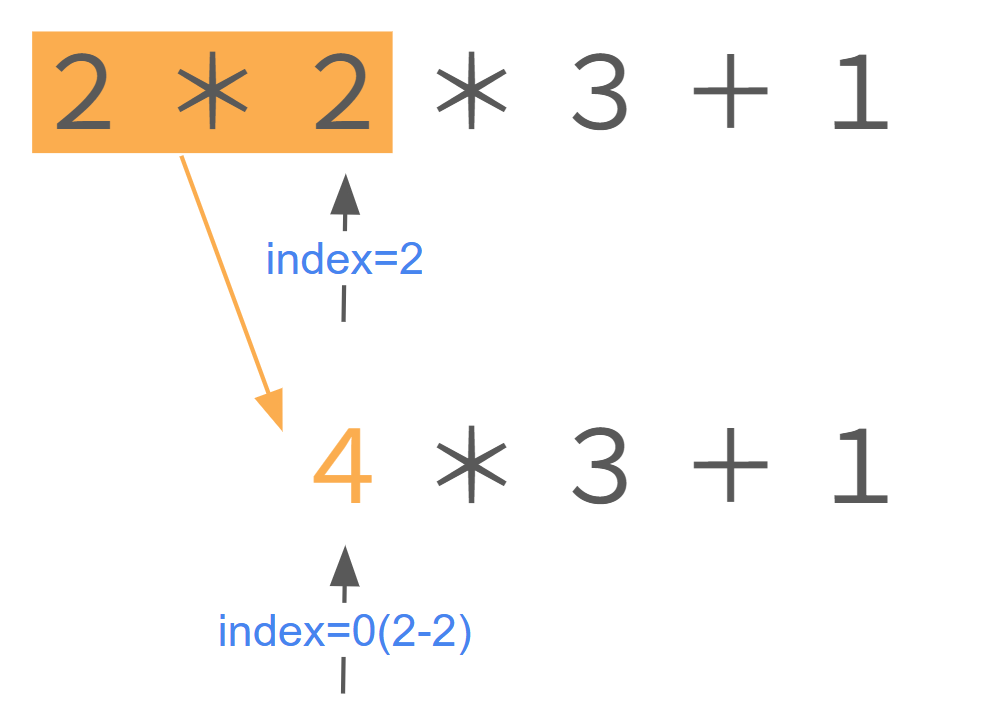
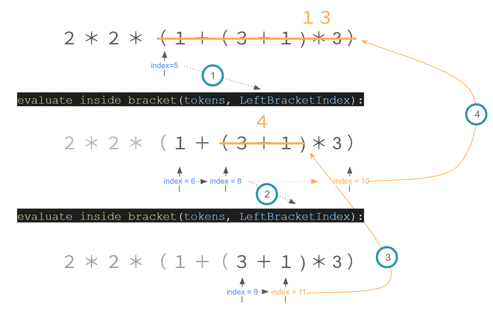

## 1. 概要

**目的**：[モジュール化された計算機プログラム](https://docs.google.com/document/d/1H6mhc7Dje0BTeIDAmCIy4GBOUC3Y1uKG8iq4qOq5QYs/edit?tab=t.0)に対して行う一連の拡張（課題1〜4）について、それぞれの設計方針をまとめる。

---

## 2. 各課題の内容

### 課題1：掛け算と割り算の追加

- 掛け算（`*`）と割り算（`/`）の演算を実装する。
- 不正な入力はないと仮定。
  - 「*」「/」と「+」「−」の優先度をしっかり扱うこと。

### 課題2：テストケースの追加

- 書いたプログラムが正しく動いていることを確認するためのテストケースを追加
  - できるだけ網羅的についかする

### 課題3：括弧に対応する機能の追加

- テストケースも追加すること

### 課題4(できれば)：関数の追加

- abs(), int(), round() に対応しよう
  - abs(-2.2) => 2.2 （絶対値）
  - int(1.55) => 1（小数を切捨てる）
  - round(1.55) => 2（四捨五入）

---

## 3. Goals and Non-Goals

### 目的（Goals）

- 拡張性の高いモジュール設計を行うこと
- テストケースを網羅的に実装すること
- 課題の条件を満たすこと

### Non-Goals

- 一般的な不正な入力への対応（例：`3 ++ 3. - 4` など構文的に誤った入力）

  - 入力の構文チェックやエラーメッセージの詳細な出力は、本実装の対象外とする。
  - 例外処理は限定的に行い、明らかなゼロ除算などにのみ対応する。
- 単項演算子や複雑な構文解析の一般対応

  - ただし、**`2 * -3` や `4 / -2` のような「乗除算における右側の負の数」**については、カッコなしでも正しく評価できるよう対応済み。

---

## 4. 提案する設計（Proposed Design）

読み取った式は、`1.0 + 2.1 - 3`の場合

```(python)
tokens = 
[{'type': 'NUMBER', 'number': 1.0}, 
{'type': 'PLUS'}, 
{'type': 'NUMBER', 'number': 2.1},
{'type': 'MINUS'}, 
{'type': 'NUMBER', 'number': 3}]
```

となるように、`tokens`という配列に各要素の型(`type`と `number`)が、格納されている

### 課題1

足し算(`PLUS`)引き算(`MINUS`)と同様に、掛け算(`MULT`)と割り算(`DIV`)を読み取る関数を追加。

また、積と商を求めて `tokens`に格納する `evaluate_multiplication_division`関数を作成した。

`tokens`内の計算を、掛け算、割り算をしてから足し算引き算をするように、`evaluate_four_operations`関数を作成した。

#### `evaluate_multiplication_division`関数

- `index`を `tokens`の長さまで1つずつ動かす
- `x`、`* or /`、`y`の順にデータが格納されているとき
  - `x`、`* or /`、`y`をそれぞれの計算結果へ変更
  - `index`を-2する

このアルゴリズムのイメージ図を以下に示す。

<div align="center">

</div>

#### `evaluate_four_operations`関数

- `evaluate_multiplication_division`関数に `token`を入れることで、`token`を掛け算や割り算のない式にする
- `evaluate_plus_minus`関数に `token`を入れることで、`token`内の計算を行い、答えを出す

### 課題2

テストケースを以下のように追加した。

```(python)
test("4-2*3+1+1/2") # 掛け算割り算入り混じっている
test("3*2/4*1") # 何回もかけたり割ったりする
test("2/0")   # 0で割る(自分で定義した仕様)
test("0.1*100/2+5") # 小数点をいれてみる
test("1+2*3")   # 掛け算と足し算の順序
test("2*3") # 掛け算
```

課題3の後に追加したテストケースは以下である。

```(python)
test("(2+3)*(4-6)") # 括弧の実装
test("((3+4)*(6+1))*((5.2-3.4)*(24/(2*3)))")    # 括弧が複数回存在するとき
```

課題4の後に追加したテストケースは以下である。

```(python)
test("abs(-4*(int(4.3)))")  # 括弧の中に関数があるとき
test("abs(int(-2.34)*(-1))+round(2.34*abs(int(-45/4)))")    # 全部入れ子構造のとき
test("abs(2-3)+round(234.342+5/2)/int(-342)")  # 関数の中で計算を行っているとき
test("(abs(-2.3-abs(-3))+1)*(abs(-2*(-4))+2)")   # 絶対値の入れ子構造
test("abs(-4.7)")   # abs関数の実装
test("int(4.24)")   # int関数の実装
test("round(2.35)") # round関数の実装
```

### 課題3

左括弧が見つかったら、`evaluate_inside_bracket`関数(括弧の内部を計算する関数)を用いて、`tokens`内に括弧がない状態となるまで計算するようにした。
その後、`evaluate_four_operation`関数によって、`tokens`内の計算を行い、答えを出した。

#### `evaluate_inside_bracket`関数 ( 引数 : 左括弧の `index`)

1. 右括弧が見つかるまで、左括弧の次の文字から一文字ずつ探索していく
2. もし左括弧が見つかれば、そのときの `index`を `evaluate_inside_bracket`関数へ渡す
3. そうでなければ、探索した `tokens[index]`を `bracket_tokens`配列内に保存
4. 右括弧が見つかったら、`bracket_tokens`内を計算し、括弧内全てを置き換える

この関数のイメージ図を以下に示す。

<div align="center">
  
</div>

### 課題4

`func_name`という関数が見つかったとき、``type`:`FUNC`,`name`:`func_name``というトークンを作成する。(*1)

次に、関数内の計算を行う `evaluate_func`関数を作成した。計算した値は、`token`にいれるようにした。

また、括弧内の計算において関数がでてきたときに対応するため、`evaluate_inside_bracket`関数内で、もし`type`が`FUNC`であるようなトークンがあれば、`evaluate_func`関数を呼び出すように付け足した。

`evaluate`関数に`tokens`を渡すことで、ユーザーは計算結果を得ることができる。

#### `evaluate_func`関数 ( 引数 : `funcIndex`(関数がある`token`の `index`))

1. もし関数が見つかれば、そのときの `index`を `evaluate_func`関数へ渡す
2. 前のトークンが関数でなくて、今のトークンが左括弧だったとき、課題3で作成した式を用いて、括弧内の計算を行う
3. 1.、2. のどちらも満たさず右括弧がみつかったとき、関数で用いている括弧内の数字を課題3で作成した式を用いて計算する。
4.  `funcIndex`がどの関数であるかを見分けて、`funcIndex+1`、つまり、括弧内の数字に対して所望の関数の計算を行う。

### `evaluate`関数

1. まず、トークン内に、関数がないかを探索
  - もしあれば、`evaluate_func`関数へ、関数があったindexを渡す
2. 関数の計算が終了した後は、括弧内の計算を処理したいため、左括弧がないかを探索
  - もしあれば、`evaluate_inside_bracket`関数を用いて括弧内の計算を行う
3. 今まで処理してきたことで、トークンは四則演算のみを行えば良い形なはずなので、`evaluate_four_operations`関数を用いて、与えられたトークンの答えを返す


## 5. 代替案の検討（Alternatives Considered）

#### (*1) 
初期案は、括弧内を計算する関数(`evaluate_inside_bracket`)のように、再帰的に計算することを考えていた。$abs(abs(3))$など、同じ関数で入れ子構造になっている場合は、`type`をそれぞれの関数によって分けることで処理が可能であった。しかし、$abs(int(-3.4))$など、異なる関数が入れ子構造になっている場合の処理が難しくなってしまう。そのため、関数の処理は`type`を`FUNC`と揃えて処理を行うようにした。今後他の関数を追加するときも処理がしやすいのではないかと考えている。


#### 再帰的処理

今回のプログラムでは、括弧内や関数内の入れ子構造に対して再帰的処理を行っている。最初のコーディングでは、処理を行う前のトークンを全て他の配列で保存していた。しかし、これでは無駄が多く、大きなインプットを得たときに処理が重くなってしまう。そこで、再帰的処理に必要な計算を全てインデックスの管理のみで処理するコーディングを行うことができたため、大幅に変更した。(6/11)
<!-- 
## 6. Open Questions -->
