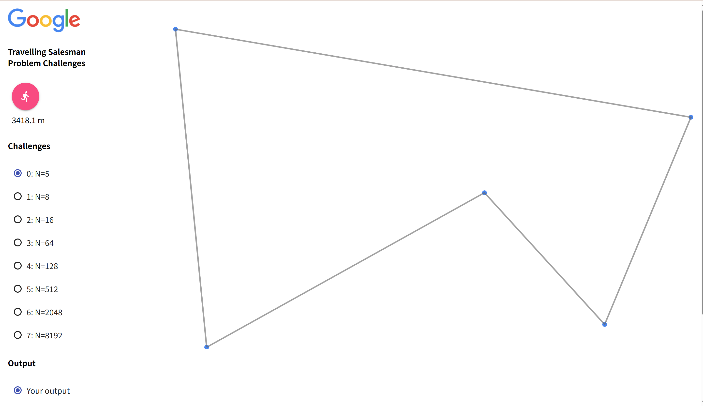
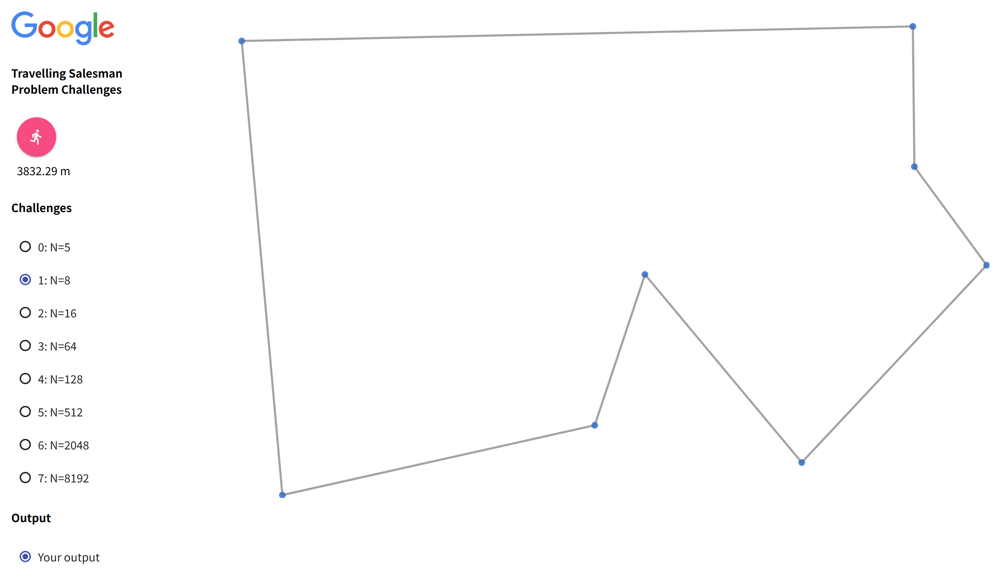
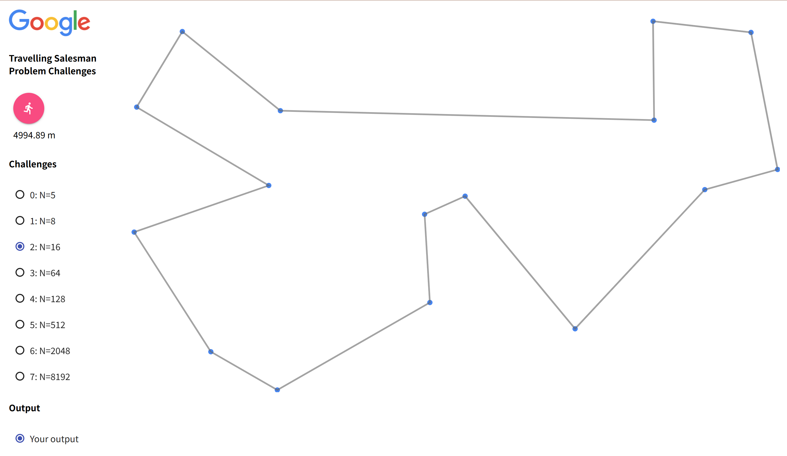
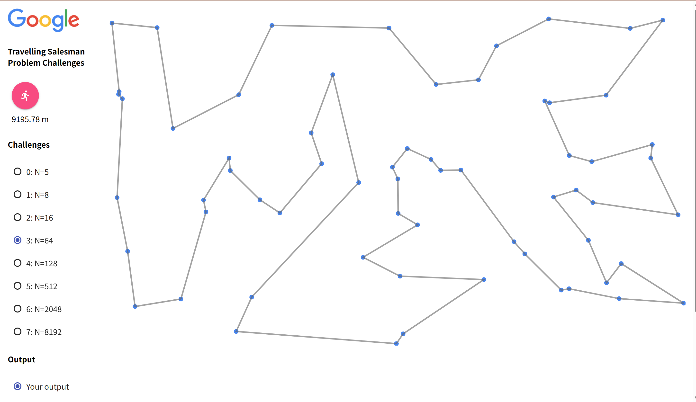
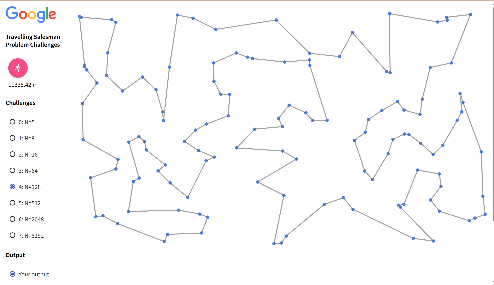
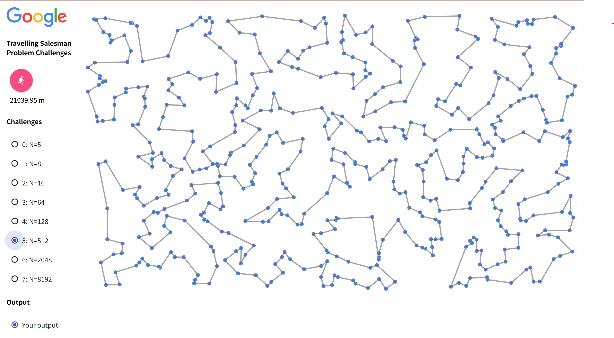
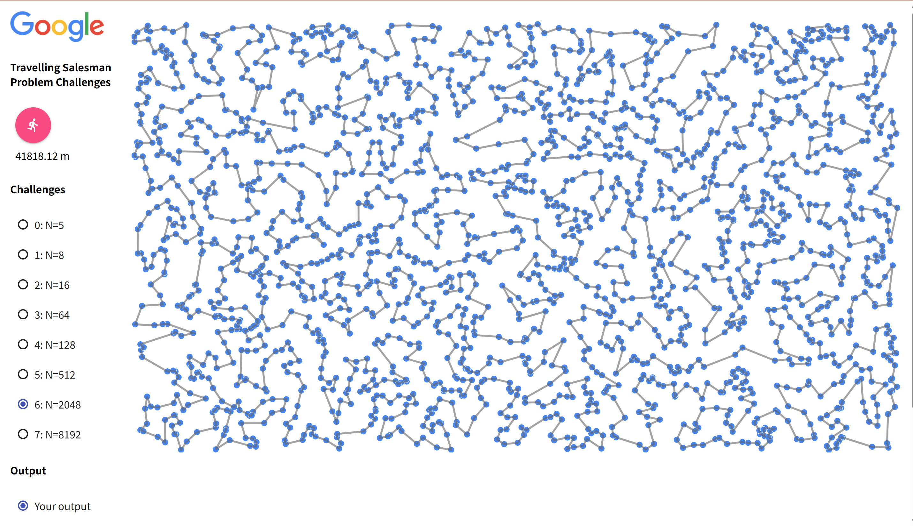

## 1. 概要

TSP(Traveling Salesperson Problem)について考える。

```
python -m http.server # For Python 3
python -m SimpleHTTPServer 8000 # If you don’t want to install Python 3
```

を実行した後に、`http://localhost:8000/visualizer/build/default/`のリンクを開くことでビジュアライズ可能。

## 2. 各課題の内容

TSPを実際に実装して、様々なアルゴリズムや工夫をしてみる。

[サンプルコード](https://github.com/hayatoito/google-step-tsp)を用いた。

## 3. 提案する設計

### 1 2-opt法

```(python)
     2-opt
       A     B         \   A -----→ B
         \ /   ↖  ----- \             ↘
          /     X        〉            X 
         ↙ ↘   ↗  ----- /             ↙
       C     D         /   C ←----- D
```

ルート内に、左のようなクロスが発生してしまっているとき、[A,D,X,B,C] ===> [A,B,Xの逆,D,C]のように、その紐をほどき、クロスをなくした。

1. 上記図のA->D　エッジを探索
   a. 上記図のB->C　エッジを探索
   b. A -> D とB -> C　が異なるエッジのとき
   (A->DとB->Cの長さ) > (A->BとC->Dの長さ)なら、D,X,Bの配列を、B,Xの逆順, Dの順に格納する
2. 1. を、変更がなくなるまで繰り返す

### 2. 蟻コロニー最適化 🐜

貪欲法→2opt法を行ったあとの経路に重みづけをした状態で、アリコロニー最適化を行う。


1. エージェント(蟻)とフェロモンの初期化を行う(貪欲法などで得た解に初期フェロモンを追加する)
2. 終了条件を満たすまで、以下の処理を繰り返す。
   1. 各エージェントに対して、フェロモンとヒューリスティックな情報(今回は距離の逆数とした)に基づいて解の選択を行う。(*)
   2. 各エージェントが分泌するフェロモンを計算
   3. フェロモン情報の更新
3. 最も良い成績のエージェントの解を出力する。


(*) 解の選択方法

今、都市 `i`にいるとする。

また、まだ訪問していない都市の集合を `Ω`とする。

`Ω`の全ての都市について、以下の評価値を計算して、次に回る都市を決める


##### 📚 参考文献

1. ganyariya, 「【Python】蟻コロニー最適化法で巡回セールスマン問題（TSP）を解いてみた」, Qiita, 2020.  
   [https://qiita.com/ganyariya/items/25824f1502478a673005](https://qiita.com/ganyariya/items/25824f1502478a673005)

2. 田辺良人, 「最適化アルゴリズムの話」, 横浜国立大学 スライド資料.  
   [https://ryojitanabe.github.io/pdf/t-ynu-oa_slides.pdf](https://ryojitanabe.github.io/pdf/t-ynu-oa_slides.pdf)


## 4. 実行結果

### 1. 2-opt法を用いたとき

<!-- 1行目：4枚 -->

<p align="center">
  
  
  
  
</p>

<!-- 2行目：3枚 -->

<p align="center">
  
  
  
</p>
