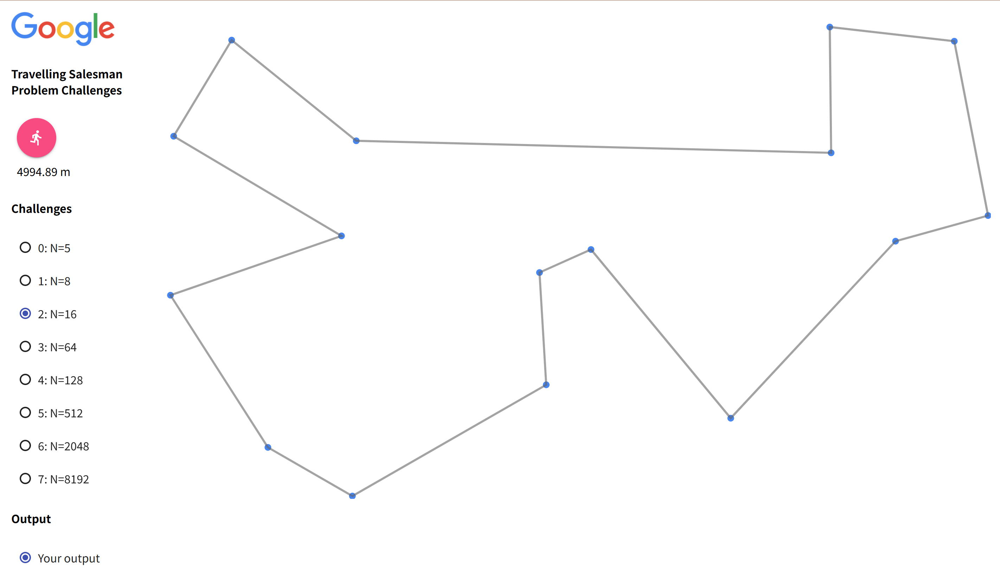
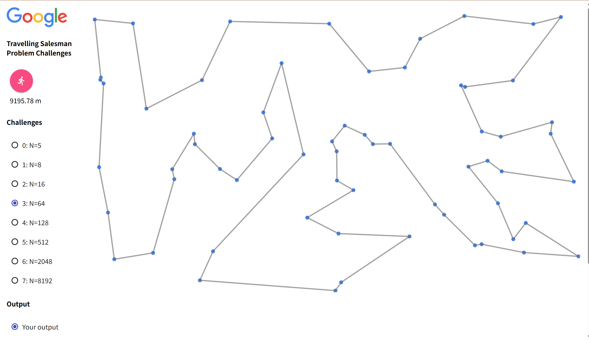

## 1. 概要

最短経路問題について考える。

`http://localhost:8000/visualizer/build/default/`を用いてビジュアライズ可能。

## 2. 各課題の内容

TSPを実際に実装して、様々なアルゴリズムや工夫をしてみる。

[サンプルコード](https://github.com/hayatoito/google-step-tsp)を用いた。

## 3. 提案する設計

### 1 2-opt法

```(python)
     2-opt
       A     B         \   A -----→ B
         \ /   ↖  ----- \             ↘
          /     X        〉            X 
         ↙ ↘   ↗  ----- /             ↙
       C     D         /   C ←----- D
```

ルート内に、左のようなクロスが発生してしまっているとき、[A,D,X,B,C] ===> [A,B,Xの逆,D,C]のように、その紐をほどき、クロスをなくした。

1. 上記図のA->D　エッジを探索
  a. 上記図のB->C　エッジを探索
  b. A -> D とB -> C　が異なるエッジのとき
     (A->DとB->Cの長さ) > (A->BとC->Dの長さ)なら、D,X,Bの配列を、B,Xの逆順, Dの順に格納する
2. 1. を、変更がなくなるまで繰り返す 

## 4. 実行結果

### 1. 2-opt法を用いたとき


<!-- 1行目：4枚 -->

<p align="center">
  
  
  
  
</p>

<!-- 2行目：3枚 -->

<p align="center">
  
  
  
</p>


## 6. Open Questions


## 7. 計算量

時間：`O(E)`
空間:`O(V)`

負のコストが辺に入っていたら、ベルマンフォード法がある！

delta を0にするのは、コンピュータの整数の仕組み上、とても難しい！
