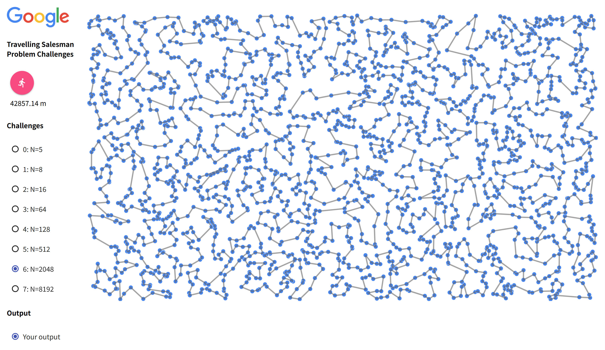
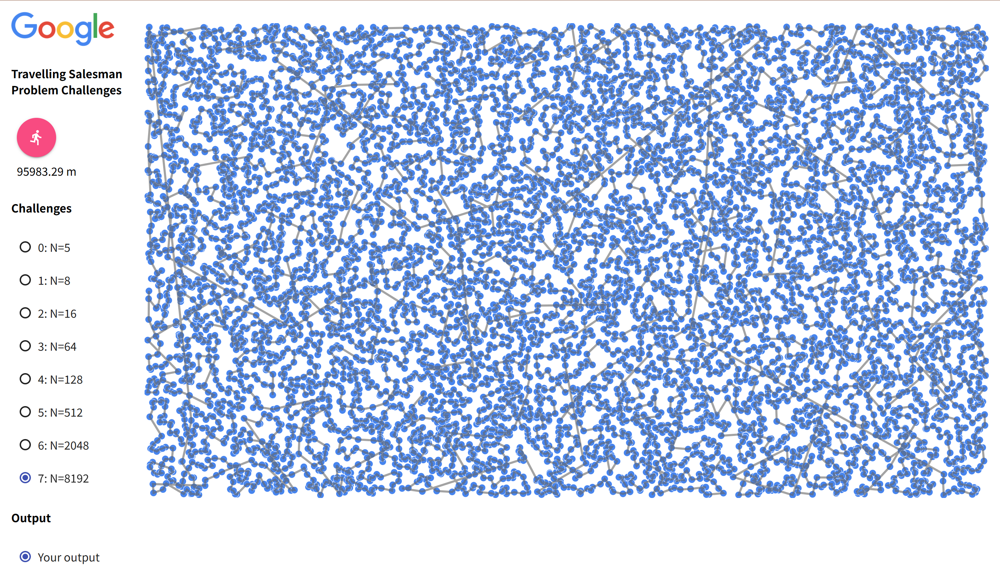
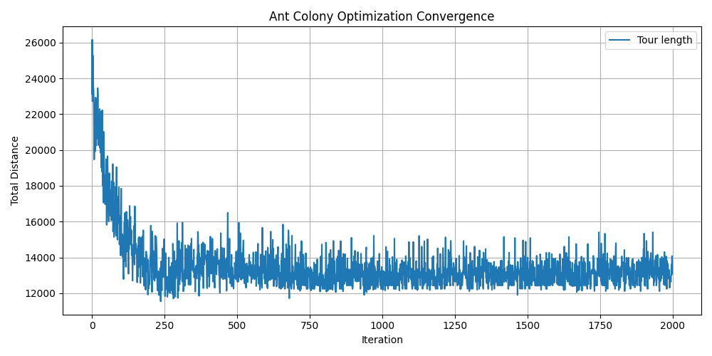
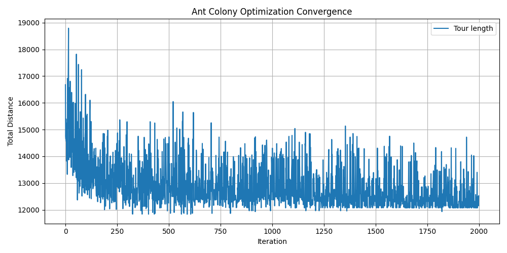
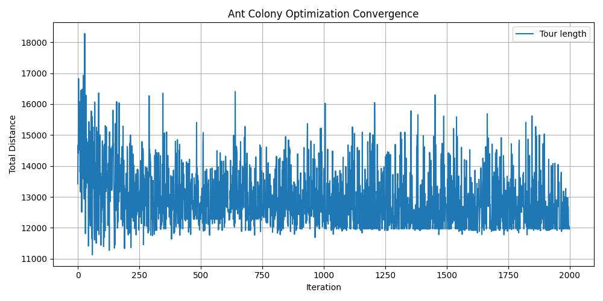
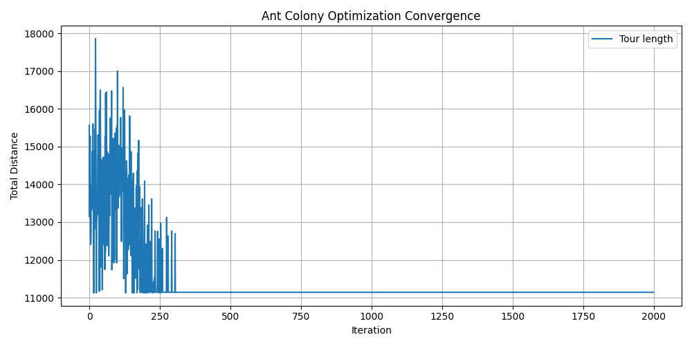
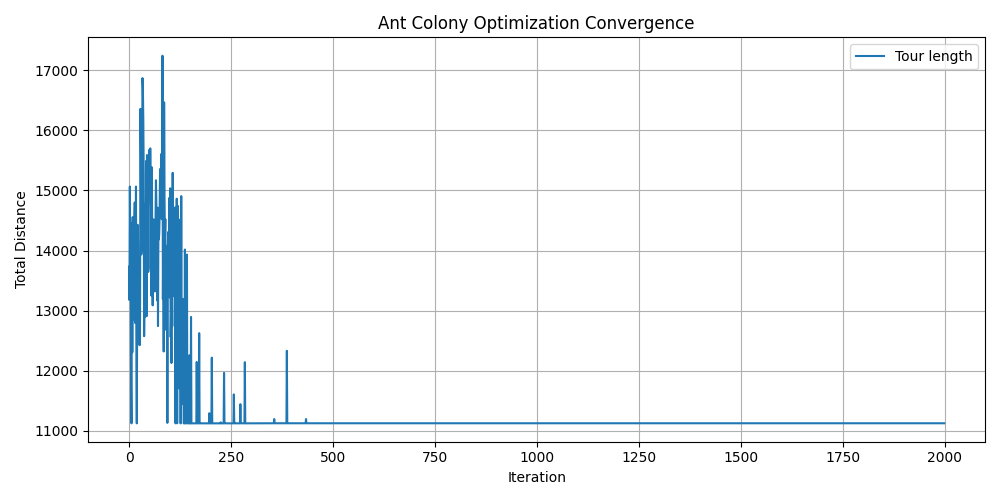
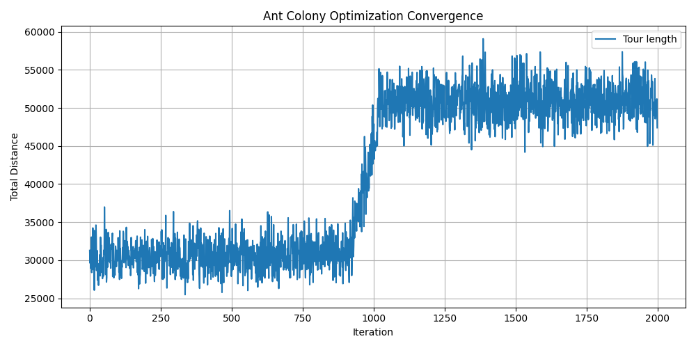
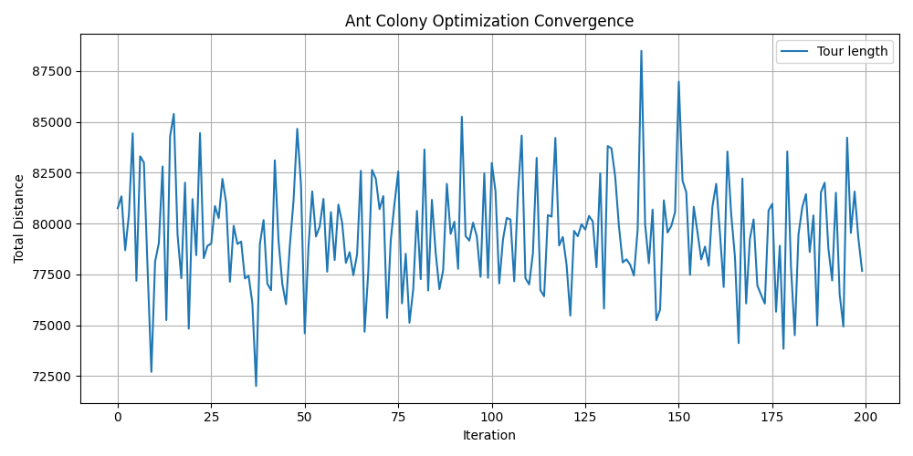
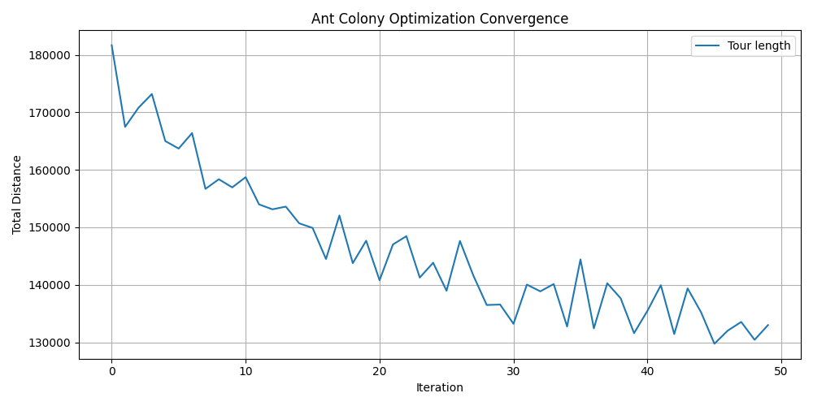

## 1. 概要

課題5に引き続き、TSP(Traveling Salesperson Problem)について考える。

```

python -m http.server # For Python 3

python -m SimpleHTTPServer 8000 # If you don’t want to install Python 3

```

を実行した後に、[リンク](http://localhost:8000/visualizer/build/default/)を開くことでビジュアライズ可能。

## 2. 各課題の内容

TSPを実際に実装して、様々なアルゴリズムや工夫をしてみる。

[サンプルコード](https://github.com/hayatoito/google-step-tsp)を用いた。

貪欲法を用いた後に、2-opt法を用いたときの経路長([コード](https://github.com/Rei-0a/STEP/tree/main/05_TSPChallenge))よりも、短くなるようなアルゴリズムを考える。また、今回用いるデータは、都市の長さ `N`が、`N=2048`のとき、`N=8192`のときを考える。

## 3. 提案する設計

### 1 2-opt法

```(python)

     2-opt

       A     B         \   A -----→ B

         \ /   ↖  ----- \             ↘

          /     X        〉            X 

         ↙ ↘   ↗  ----- /             ↙

       C     D         /   C ←----- D

```

ルート内に、左のようなクロスが発生してしまっているとき、[A,D,X,B,C] ===> [A,B,Xの逆,D,C]のように、その紐をほどき、クロスをなくした。

1. 上記図のA->D　エッジを探索

   a. 上記図のB->C　エッジを探索

   b. A -> D とB -> C　が異なるエッジのとき

   (A->DとB->Cの長さ) > (A->BとC->Dの長さ)なら、D,X,Bの配列を、B,Xの逆順, Dの順に格納する

2.1. を、変更がなくなるまで繰り返す

### 2. 蟻コロニー最適化 🐜

貪欲法→2opt法を行ったあとの経路に重みづけをした状態で、アリコロニー最適化を行う。

1. エージェント(蟻)と重み行列の初期化を行う(貪欲法などで得た解に初期重みを追加する)
2. 各エージェントに対して以下の処理を繰り返す。
   1. (まだ通っていない)各都市に対して、重みとヒューリスティックな情報(今回は距離の逆数とした)に基づいて解の選択を行う。(*)
   2. 重みを更新する(**)
3. 最も良い成績のエージェントの解を出力する。

##### (*) 解の選択方法

今、都市 $i$にいるとする。

また、まだ訪問していない都市の集合を $Ω$とする。

このとき、各アリが現在の都市 $i$ から次の都市 $j\in\Omega$ を選択する確率 $P_{ij}$ を以下のように定義した

$$
P_{ij} = \frac{\tau_{ij}^{\alpha} \cdot \eta_{ij}^{\beta}}{\sum_{k \in \text{allowed}} \tau_{ik}^{\alpha} \cdot \eta_{ik}^{\beta}}
$$

- $\tau_{ij}$：辺 $(i, j)$ 上の重み量
- $\eta_{ij} = \frac{1}{d_{ij}}$：都市 $i$ から $j$ へのヒューリスティック情報（距離の逆数）
- $\alpha$：重みの重要度を調整するパラメータ（例：1）
- $\beta$：ヒューリスティック情報の重要度を調整するパラメータ（例：2）

  この確率に基づいて、ランダムに次の都市を選んだ。

##### (**) 重みの更新

今までの重みをある割合 `evapotarion_tate`倍して、減少させた。その後、解として得たルートに、そのルートの総距離の逆数だけ重みを足しいれた。

##### 変数の設定

重みの追加を行うときを、最適値の105%以内の値にするよりも、そのままの方がよさそうであった

##### 📚 参考文献

1. ganyariya, 「【アントコロニー最適化(ACO)を救いたい」, Qiita, 2021.[https://qiita.com/ganyariya/items/25824f1502478a673005](https://qiita.com/ganyariya/items/25824f1502478a673005)
2. 田邊遼司, 「進化計算アルゴリズムの改良研究～アリコロニー最適化を例に～」, 横浜国立大学 スライド資料.
   [https://ryojitanabe.github.io/pdf/t-ynu-oa_slides.pdf](https://ryojitanabe.github.io/pdf/t-ynu-oa_slides.pdf)

## 4. 実行結果

<div style="display:flex; justify-content:space-around; align-items:flex-start; flex-wrap:wrap;">
  <div style="flex:1; min-width:300px; max-width:48%; text-align:center; margin:10px;">
    <p>N = 2048 のとき</p>
    
  </div>
  <div style="flex:1; min-width:300px; max-width:48%; text-align:center; margin:10px;">
    <p>N = 8192 のとき</p>
    
  </div>
</div>

今回の私の結論を先に述べると、**上手くいかなかった**。
N = 2048のときは、アリコロニー最適化(200回ループ)ではなく、貪欲法→2opt法を適応したものの方が最短経路となった。N = 8192のときは、実行時間の関係で貪欲法→2opt法の最短経路はわからないが、アリコロニー最適化(50回ループ)の結果を載せた。N = 256やN = 2048のときの実行結果から推測するに、恐らくアリコロニー最適化で求めた経路の方が、貪欲法→2opt法で求めた経路より長いと考えられる。
これは、アリコロニー最適化のパラメータチューニングが上手くできていないことが原因だと考えている。 4.1節ではパラメータの試行錯誤について述べる。


## 4.1 アリコロニー最適化のパラメータチューニング(上手くいっていない)

ひとまず、N=128でいくつか実験をした。
初期解として与えるものを変化させた。

- 初期解としてランダムなものを与えたとき解 > 11544.618730372871
  

- 貪欲法で得た解を初期解にしたとき > 11834.474843435244


- 貪欲法→2optで得た解を初期解にしたとき > 11124.659836444922
  

**[問題点?]**
2-opt法を初期解とする方がいい気がするが、2-optがかなり良い局所解だった場合に、そこから抜け出せない気がしている。

- 重みを更新するときを、今得た最適解から、最適値の大きさが105%以内の解のみにした場合 > 11124.659836444918


- 重みを更新するときを、今得た最適解から、最適値の大きさが110%以内の解のみにした場合 > 11124.659836444918
  

**[問題点?]**
振動がなくなったが、これをしてしまうと、局所解から抜け出せない気がする。

- N=256のとき
なんでこうなるのかわからない結果になってしまった。


- N= 2048のとき
もっとパラメータチューニングをしてから実行したかった😭結局この際に得られたものよりも貪欲法→2opt法の方が良かった。


- N = 8192のとき
処理に時間がかかりすぎて、貪欲法→アリコロニー最適化法を適用し、アリの数も50にした。まだ減少しそうなグラフになったので、授業までアリをもう少し増やして実行し続けてみる


画像は載せていないが、他にも、
- $\alpha$の値や$\beta$の値をそれぞれ変化させてみて、N=128のときに最も良くなるような値を探す
- 初期解に与える重みの量はどれほどが良いのか
- 重みの最大値最小値を設けることで、局所解にはまりすぎることを防ぐことができるのではないか
- 今までの経路よりも良い経路を通ったときに重みの量を増加させることで、良い解に沿ったルートを探索しやすくなるのではないか
などを試した。

時間がなくて、他にも$\alpha$や$beta$、アリの数、初期解の重みの設定値、アリが通った場所につける重みの量、より最適な解が見つかったときに重みを増すのか否か、など、多くのパラメータを人為的に決定する必要があり、本当に難しかった。ランダム性をもつアルゴリズムなので、上手くいくときと上手くいかないときがあり、実用にはかなり向いていない気がした。


## 5. まだ取り組めていないこと

- きちんと局所解なパラメータを見つる
- (今のままだと、アリコロニー最適化よりも貪欲法+2optの方が良い、、、😭)
- 貪欲法->2opt->アリコロニー最適化の流れにしていると、2optでそこそこ良い局所解が求められているから、他の局所解を見に行けずに良い解が出せない？可能性がある。そこで、今は2-optを、交差部分がなくなるまで適応しているが、途中で打ち切ってアリコロニー最適化をやってみると、また違う結果がでるかもしれない
- 解の更新がほとんどなくなってしまったときに、再度他の場所に重みを加えて(ランダムにするのか、今の最適解でリセットするのかは要検討)からループを行う？
- 領域を分割して考えることができていない
- 焼きなまし法やGA、2.5opt法、3opt法の実装
- 現在は距離や重みを$N*N$配列に入れている。もっと良い方法の模索。

## 6. Open Questions

- N(都市数)が変わると、パラメータは再考する必要があるのか？
- N=256のときに、なんど試しても最初は減衰するが、後に増加して収束するようなグラフになってしまったのか？
- うまくいくパラメータチューニング方法や、4.1 節の私の試行錯誤で、他に試してみた方がよかったことも知りたい。
- 初期解として、良い解を最初に提示しているのに、最初のアリは、その解の約2倍の解から選択し始める。不思議。

## 7. 計算量
アリの数をM、都市数をNとした場合、
アリコロニー最適化の時間計算量は$O(MN^2)$
　　　　　　　　　　空間計算量は$O(N^2)$